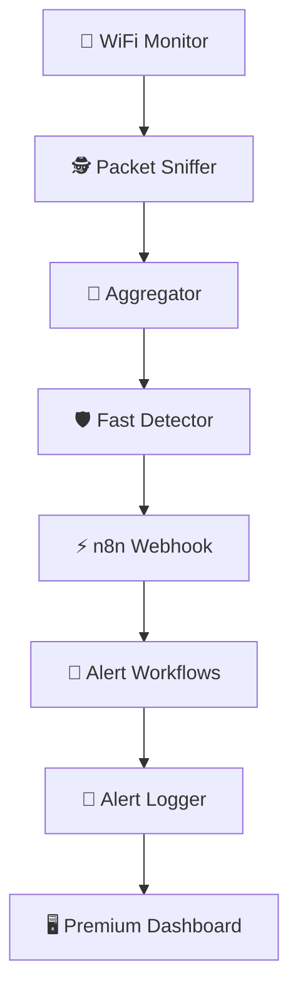

# Antigravity | WiFi Deauth Defense System

> [!IMPORTANT]
> **Premium Defense Protocol Active**  
> This system is now part of the Antigravity Defensive Perimeter.

## 🌈 Architecture Overview



## 🖥️ Local Dashboard
The system now includes a stunning local dashboard for monitoring:
- **Location**: [DASHBOARD.html](file:///home/thunder/piplineflow/DASHBOARD.html)
- **Features**: Real-time status, quick links, and SOP guides.

## 📁 System Components

- **Docker & Docker Compose**: For running n8n
- **Python 3.8+**: For detector scripts
- **Root/sudo access**: For packet capture with Scapy
- **Linux**: Tested on Ubuntu

### Install Dependencies

```bash
# Install Docker (if not already installed)
curl -fsSL https://get.docker.com -o get-docker.sh
sudo sh get-docker.sh

# Install Python packages
python3 -m pip install scapy requests

# Verify Python version
python3 --version
```

## Quick Start

### 1. Start the System

```bash
cd /home/thunder
chmod +x start_defender.sh
sudo -E bash start_defender.sh
```

The script will:
1. Start n8n in Docker (port 5678)
2. Install Python dependencies
3. Start the packet detector with webhook integration

### 2. Access n8n Dashboard

- URL: `http://localhost:5678`
- The dashboard opens in your browser automatically
- Configure webhook workflows as needed

### 3. Monitor Alerts

Alerts are logged to: `/home/thunder/.n8n/alerts/`

```bash
# View live alerts
tail -f /home/thunder/.n8n/alerts/alerts_*.jsonl

# Check for high-severity alerts only
grep "HIGH\|CRITICAL" /home/thunder/.n8n/alerts/alerts_*.jsonl
```

## System Components

### 1. **fast_detector.py** (Enhanced)
Real-time packet analyzer that detects:
- Traffic floods (per-IP packet rate)
- Port scans (unique port connections)
- UDP traffic spikes
- Anomalous packet rates (PPS)
- SYN probes

**Sends alerts via webhook** to n8n instead of just printing.

**Usage:**
```bash
# Auto-detect interface
sudo python3 fast_detector.py -f ip -w 10

# Specify interface
sudo python3 fast_detector.py -i eth0 -f ip -w 10 -c 1000
```

**Environment Variables:**
```bash
export N8N_WEBHOOK_URL="http://localhost:5678/webhook/wifi-deauth-alerts"
export WEBHOOK_ENABLED="true"
export AGGREGATION_WINDOW="10"
```

### 2. **webhook_alerter.py** (New)
Webhook client that:
- Sends alert events to n8n
- Handles retries with exponential backoff
- Caches failed alerts for retry
- Supports event deduplication

**Key Features:**
- 3 automatic retries with exponential backoff
- 5-second timeout (configurable)
- Environment variable configuration
- Failed alert tracking

**Usage in Code:**
```python
from webhook_alerter import get_alerter

alerter = get_alerter()
alerter.send_alert(
    severity="HIGH",
    attack="Port Scan",
    source="192.168.1.100",
    details={"unique_ports": 25}
)

# Retry failed alerts
alerter.retry_failed_alerts()
```

### 3. **alert_logger.py** (New)
Persistent alert storage that:
- Saves alerts to JSON Lines format
- Auto-rotates log files (10MB default)
- In-memory buffer for quick queries
- Summary statistics
- Export functionality

**Usage:**
```python
from alert_logger import get_logger

logger = get_logger()
logger.log_alert(alert_dict)

# Query recent alerts
high_severity = logger.get_recent_alerts(severity="HIGH", limit=10)

# Get summary
summary = logger.get_alert_summary()
print(f"Total alerts: {summary['total_alerts']}")
```

### 4. **detector_config.py** (New)
Centralized configuration with environment variable support.

**Configuration Options:**

```bash
# Network Settings
export WIFI_INTERFACE="wlan0"
export CAPTURE_FILTER="ip"

# Detection Thresholds
export FLOOD_THRESHOLD="100"
export PORT_SCAN_THRESHOLD="20"
export UDP_RATIO_THRESHOLD="0.85"
export ANOMALY_PPS_THRESHOLD="500"

# Webhook Settings
export N8N_WEBHOOK_URL="http://localhost:5678/webhook/wifi-deauth-alerts"
export WEBHOOK_TIMEOUT="5"
export WEBHOOK_MAX_RETRIES="3"
export WEBHOOK_RETRY_DELAY="1.0"
export WEBHOOK_ENABLED="true"

# Logging
export ALERT_LOG_DIR="/home/thunder/.n8n/alerts"
export MAX_LOG_FILE_SIZE_MB="10"
export FILE_LOGGING_ENABLED="true"

# Performance
export USE_PCAP="true"
export NUM_WORKERS="1"
```

## n8n Integration

### Webhook Endpoint

The detector sends alerts to: `http://localhost:5678/webhook/wifi-deauth-alerts`

**Alert Payload Format:**
```json
{
  "timestamp": "2026-02-05T18:51:16Z",
  "severity": "HIGH",
  "attack_type": "Port Scan",
  "source": "192.168.1.100",
  "details": {
    "unique_ports": 25
  },
  "alert_id": "uuid-string",
  "system": "wifi_deauth_defender"
}
```

### Included Workflow

A basic workflow template is provided: `n8n/wifi_deauth_workflow.json`

**Nodes:**
1. **Webhook** - Receives alert events
2. **Enrich Alert Data** - Adds processing metadata
3. **Is High Severity?** - Routes based on severity
4. **Log High Severity Alert** - Shell command logging
5. **Log Alert Event** - Persistent event logging
6. **Store Alert in DB** - (Optional) Database integration
7. **Send Response** - HTTP response to detector

**To Import Workflow:**
1. Open n8n dashboard
2. Click "Import from file"
3. Select `n8n/wifi_deauth_workflow.json`
4. Activate the workflow

### Creating Custom Workflows

n8n supports:
- **Slack/Discord/Email** notifications for alerts
- **Database storage** (MySQL, PostgreSQL, MongoDB)
- **Analytics dashboards** (Grafana, Tableau integration)
- **Incident management** (Jira, ServiceNow)
- **Gemini API** for deep analysis

Example: Send Slack notification on HIGH severity
```
Webhook → Enrich → Is High Severity? → Slack Node → Response
```

## Docker Compose Configuration

File: `/home/thunder/n8n/n8n/docker-compose.yml`

**Key Environment Variables:**
- `N8N_WEBHOOK_URL`: Base URL for webhooks
- `DB_TYPE`: Database type (sqlite, postgres, mysql)
- `DB_SQLITE_DATABASE`: SQLite database path
- `GENERIC_TIMEZONE`: Timezone for timestamps

**Volumes:**
- `/home/thunder/.n8n`: n8n configuration and data
- Workflow files are mounted read-only

**Network:** `wifi_defense_net` (isolated Docker network)

### Manage n8n Container

```bash
# Start/stop
cd /home/thunder/n8n/n8n
docker-compose up -d      # Start
docker-compose down        # Stop
docker-compose logs -f     # View logs

# Restart
docker-compose restart

# Update image
docker-compose pull
docker-compose up -d
```

## Alert Flow Diagram

```
Detection Engine (fast_detector.py)
    ↓
Detects Anomaly
    ↓
Creates Alert JSON
    ↓
Webhook Alerter (webhook_alerter.py)
    ├─→ Attempts to send to n8n [3 retries]
    ├─→ Stores in failed alerts cache if fails
    └─→ Prints status message
    ↓
n8n Workflow (wifi_deauth_workflow.json)
    ├─→ Receives via webhook endpoint
    ├─→ Enriches with metadata
    ├─→ Routes by severity
    ├─→ Logs event
    └─→ Sends response
    ↓
Alert Logger (alert_logger.py)
    ├─→ Saves to JSONL file
    ├─→ Stores in memory (last 1000)
    ├─→ Auto-rotates at 10MB
    └─→ Provides query interface
    ↓
Persistent Storage & Dashboard
    ├─→ Alert files: /home/thunder/.n8n/alerts/
    ├─→ Query via logger methods
    └─→ Available for dashboard access
```

## Monitoring & Debugging

### View Real-Time Alerts

```bash
# All alerts
tail -f /home/thunder/.n8n/alerts/alerts_*.jsonl | jq .

# Only HIGH/CRITICAL
tail -f /home/thunder/.n8n/alerts/alerts_*.jsonl | grep -E "HIGH|CRITICAL" | jq .

# Latest 20 alerts
tail -20 /home/thunder/.n8n/alerts/alerts_*.jsonl | jq .
```

### Check Detector Status

```bash
# See if process is running
ps aux | grep fast_detector.py

# View detector logs (if running in foreground)
sudo python3 fast_detector.py -i eth0 -f ip

# Check webhook connectivity
curl http://localhost:5678/webhook/wifi-deauth-alerts -X POST \
  -H "Content-Type: application/json" \
  -d '{
    "timestamp": "'$(date -u +%Y-%m-%dT%H:%M:%SZ)'",
    "severity": "LOW",
    "attack_type": "test",
    "source": "127.0.0.1",
    "details": {},
    "alert_id": "test-123"
  }'
```

### Check n8n Status

```bash
# Health check
curl http://localhost:5678/healthz

# View container logs
docker logs -f n8n_n8n_1

# Check active workflows
curl http://localhost:5678/api/workflows
```

### Test Alert Pipeline

```bash
# Manual test alert
python3 -c "
from webhook_alerter import get_alerter
alerter = get_alerter('http://localhost:5678/webhook/wifi-deauth-alerts')
alerter.send_alert('HIGH', 'Test Alert', '192.168.1.1', {'test': True})
"
```

## Configuration Files

| File | Purpose |
|------|---------|
| `fast_detector.py` | Main detection engine (enhanced with webhook) |
| `webhook_alerter.py` | Webhook client for n8n communication |
| `alert_logger.py` | Alert persistence layer |
| `detector_config.py` | Centralized configuration |
| `start_defender.sh` | Startup script |
| `n8n/docker-compose.yml` | n8n Docker configuration |
| `n8n/wifi_deauth_workflow.json` | Example n8n workflow |

## Troubleshooting

### Webhook Connection Failed

**Problem:** Alerts show "Connection error to n8n"

**Solution:**
1. Check if n8n is running: `docker ps | grep n8n`
2. Check webhook URL: `curl http://localhost:5678/healthz`
3. Verify network access: `ping localhost`
4. Check firewall: `sudo ufw allow 5678/tcp`

### Permission Denied on Packet Capture

**Problem:** `PermissionError: [Errno 13] Permission denied`

**Solution:**
```bash
# Run detector with sudo
sudo python3 fast_detector.py

# Or grant capabilities to Python
sudo setcap cap_net_raw=ep /usr/bin/python3
```

### Docker Not Running

**Problem:** `Cannot connect to Docker daemon`

**Solution:**
```bash
# Start Docker
sudo systemctl start docker

# Or install/reinstall
curl -fsSL https://get.docker.com -o get-docker.sh
sudo sh get-docker.sh
```

### n8n Port Already in Use

**Problem:** `Address already in use`

**Solution:**
```bash
# Find process using port 5678
sudo lsof -i :5678

# Kill process
sudo kill -9 <PID>

# Or use different port
export N8N_PORT=5679
docker-compose up -d
```

## Advanced Usage

### Custom Detection Rules

Add to `fast_detector.py` in `run_rules()`:

```python
def run_rules(window):
    # Custom WiFi deauth detection
    for src, syn_count in syn_flags.items():
        if syn_count > 50:  # Deauth attempts
            alert("CRITICAL", "WiFi Deauth Attack", src, 
                  {"syn_packets": syn_count})
```

### Export Alerts for Analysis

```python
from alert_logger import get_logger

logger = get_logger()
logger.export_alerts(
    "/tmp/alerts_report.json",
    start_date="2026-02-01",
    end_date="2026-02-05"
)
```

### Integrate with External Services

Extend n8n workflow with:
- **Slack**: Alert notifications
- **Grafana**: Metrics dashboard
- **ELK Stack**: Alert indexing
- **InfluxDB**: Time-series storage

## Performance Considerations

- **Aggregation Window**: Larger windows = fewer alerts but delayed detection
- **PCAP Backend**: Enabled by default for better performance
- **Thread Count**: Increase for high-traffic networks
- **Log Rotation**: Default 10MB; adjust based on alert volume

## Security Notes

- **Webhook Auth**: Consider adding authentication in production
- **Log Access**: Restrict access to `/home/thunder/.n8n/alerts/`
- **Network**: Use HTTPS for remote n8n deployments
- **Credentials**: Store API keys in environment variables, not code

## Support & Contributing

For issues or contributions:
1. Check alert logs for errors
2. Review n8n workflow execution history
3. Enable debug logging in detector
4. Create detailed issue reports with logs

---

**Last Updated**: 2026-02-05  
**Version**: 1.0
